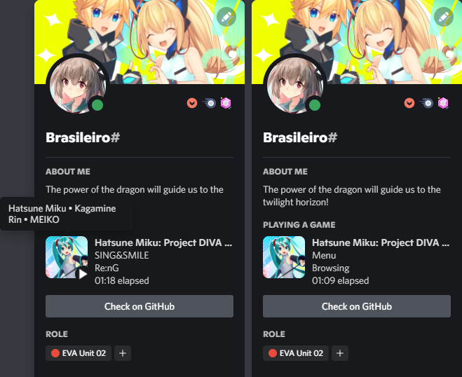

# PDRPC
Discord Rich Presence for Hatsune Miku: Project DIVA Mega Mix+.

This mod adds support for Discord Rich Presence in the game.

Displays information such as song name, author and current song performers.

Only official game songs are supported. Custom songs will not display information as the mod refers to a static database that comes with it.

If the mod replaces an official song (same id), the mod will still display the official song data.

Feel free to edit or add entries in the **"database.json"**. That way you can add new songs to the database (from custom song mods, for example) or edit existing official ones. Just keep the same pattern in the entries you add or edit.

By default, information is being displayed in English. In the future I plan to add a way to configure the locale (English or Japanese) and display the current difficulty of the song.

# Installation
1. Install [Visual C++ Runtime 2015+ x64](https://aka.ms/vs/17/release/vc_redist.x64.exe) if you don't have already installed.
2. Install [.NET Framework 4.8 Runtime](https://dotnet.microsoft.com/en-us/download/dotnet-framework/net48). If you have a minimally updated Windows 10 or higher, you will probably already have this installed by default. Install only if necessary.
3. Install [DivaModLoader](https://github.com/blueskythlikesclouds/DivaModLoader) or [DivaModManager](https://github.com/TekkaGB/DivaModManager).
4. Download the [latest release](https://github.com/Braasileiro/PDRPC/releases/latest) and extract the zip contents on the **"mods"** folder in the Project DIVA installation directory. For **DivaModManager**, just drag and drop the zip file in the mod grid.

# Usage
Just play the game my little PogChamp. The Discord Activity will show up.

# Thanks
This project uses an amazing library called [DllExport](https://github.com/3F/DllExport).

# Showcase

  

