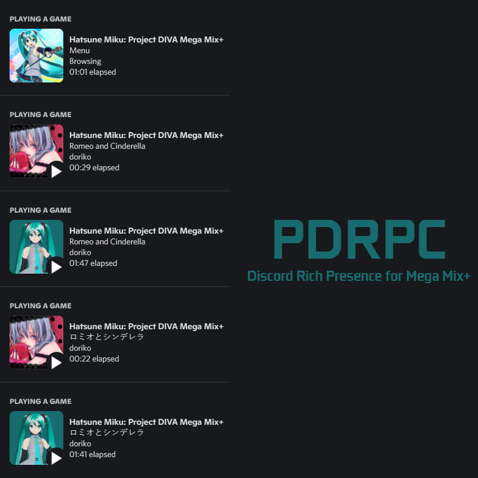

# PDRPC
Discord Rich Presence for Hatsune Miku: Project DIVA Mega Mix+.

This mod adds support for Discord Rich Presence in the game.

Displays information such as song name, author, album art, difficulty and current song performers, **including custom songs.**

It also indicates when you are just watching the PV.

# Installation
* .NET Framework 4.8 Runtime. This is normally built into minimally updated Windows.
* Install [Visual C++ 2015+ x64 Runtime](https://aka.ms/vs/17/release/vc_redist.x64.exe) if you don't have already installed.
* Install [DivaModLoader](https://github.com/blueskythlikesclouds/DivaModLoader) or [DivaModManager](https://github.com/TekkaGB/DivaModManager).
* Download the [latest release](https://github.com/Braasileiro/PDRPC/releases/latest) and extract the zip contents on the **"mods"** folder in the Project DIVA installation directory. For **DivaModManager**, just drag and drop the zip file in the mod grid.

**This mod has an [GameBanana](https://gamebanana.com/mods/389105) release.**

# Usage
Just play the game my little PogChamp. The Discord Activity will show up.

**The PDRPC will try to reconnect to Discord if it is closed or opened after the game, but preferably open the Discord before the game.**

# Configuration
There are some settings you can change in **config.toml** file. Default values:

**Album Art**: Enabled.
<br>Shows the album art of the song. If no album art, defaults to the image of first performer. The mod contains album arts for all official songs and [Restore Cut Songs Mod](https://gamebanana.com/mods/383478).</br>

**Japanese Names**: Disabled.
<br>Shows the song info in japanese whenever possible.</br>

**Show Difficulty**: Enabled.
<br>Shows the difficulty of the current song with a colored icon (corresponding to the difficulty), in addition to the text in the small icon when hovering over.</br>

# User Custom Data
As of version 0.1.4, the application will try to fetch custom song data from memory, but still following the default priority: **User Data > Internal Data > Read Memory > Fallback**.

The mod supports loading user custom data. With this you can add songs to the rich presence database (like song packs) or overwrite official song data. As of version 0.0.6 the default database is now internal to the mod, so the only way to add and edit entries is this way.

Create the **database_user.json** file inside the **PDRPC** mod folder. Here's an example of what the file format should look like:
```json
[
  {
    "id": 999,
    "album": 233,
    "jp": {
      "name": "曲名",
      "arranger": "ソングアレンジャー",
      "illustrator": "ソング・イラストレーター",
      "lyrics": "曲の歌詞",
      "music": "歌謡曲"
    },
    "en": {
      "name": "Song Name",
      "arranger": "Song Arranger",
      "illustrator": "Song Illustrator",
      "lyrics": "Song Lyrics",
      "music": "Song Music"
    },
    "performers": [
      {
        "chara": "MIK",
        "role": "VOCAL"
      },
      {
        "chara": "RIN",
        "role": "GUEST"
      }
    ]
  }
]
```
The file is self explanatory. It's basically a comma separated array of objects, a standard json array.

But pay attention to these fields:

**id**: The song id. If you put here any id that already exists within the game, this record will **overwrite** the data that rich presence will show. Required field.

**album**: The album art id. It can be **null** or **not declared**. You can check all available arts [**here**](ALBUMS.md).

**jp** and **en**: The song info data. Required fields.

**performers**: An array that indicates the artists of the song. It can be **null** or **not declared**.
* **chara**: The performer identifier.
   * **KAI**: KAITO
   * **LEN**: Kagamine Len
   * **LUK**: Megurine Luka
   * **MEI**: MEIKO
   * **MIK**: Hatsune Miku
   * **RIN**: Kagamine Rin

* **role**: The performer role on the song. **VOCAL** or **GUEST**.

# Thanks
* [Newtonsoft.Json](https://github.com/JamesNK/Newtonsoft.Json).
* [discord-rpc-sharp](https://github.com/Lachee/discord-rpc-csharp).
* The amazing [DllExport](https://github.com/3F/DllExport).

# Showcase
<p align="center">
  
</p>
